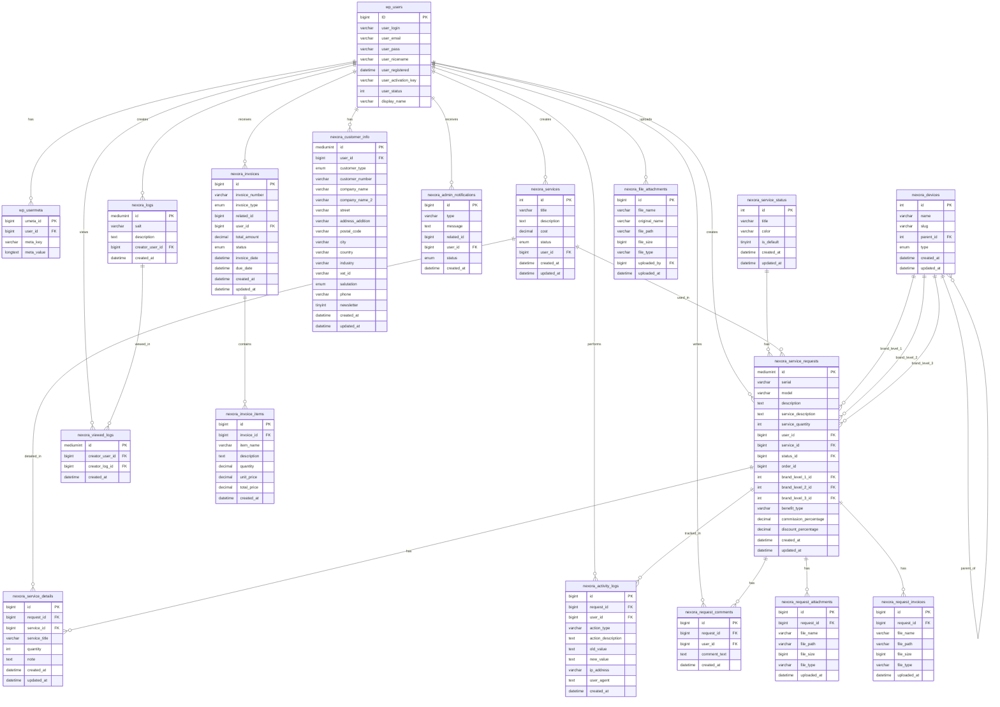

# Database Schema Diagram - Nexora Service Suite Plugin

## Main Tables Structure

## Key Relationships

### User Management
- `wp_users` - WordPress core users table
- `wp_usermeta` - User metadata (benefit_type, payment_status, etc.)
- `nexora_customer_info` - Extended customer information

### Service Management
- `nexora_services` - Available services
- `nexora_service_status` - Service statuses (Neu, In Bearbeitung, etc.)
- `nexora_service_requests` - Main service requests table
- `nexora_service_details` - Multiple services per request

### Device Management
- `nexora_devices` - Hierarchical device structure (type > brand > series > model)
- Connected to service requests via brand_level_1_id, brand_level_2_id, brand_level_3_id

### Financial Management
- `benefit_type` in usermeta: 'commission' or 'discount'
- `commission_percentage` and `discount_percentage` in service_requests
- `payment_status` in usermeta: 'paid' or 'unpaid'
- `nexora_invoices` - Invoice management

### Activity Tracking
- `nexora_activity_logs` - All user actions
- `nexora_admin_notifications` - Admin notifications
- `nexora_logs` - System logs
- `nexora_viewed_logs` - Log viewing tracking

### File Management
- `nexora_file_attachments` - General file attachments
- `nexora_request_attachments` - Request-specific attachments
- `nexora_request_invoices` - Invoice file attachments

## Important Notes

1. **Benefit System**: Users with `benefit_type = 'commission'` can see financial accounts
2. **Payment Tracking**: Payment status is stored in usermeta, not per request
3. **Device Hierarchy**: Devices are organized in a tree structure
4. **Multiple Services**: One request can have multiple services via service_details table
5. **Activity Logging**: All actions are logged for audit purposes
